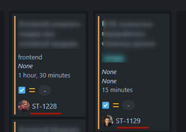

import { Callout } from 'nextra/components'

# 8. Соглашение о коммитах

<Callout type={'info'} emoji={'❗'}>
  [За основу взято руководство RS School](https://docs.rs.school/#/git-convention)
</Callout>

## 8.1. Требования к именам коммитов
* Названия коммитов должны быть согласно [гайдлайну](https://www.conventionalcommits.org/ru/v1.0.0/)
* Для того чтобы удобно было контролировать таски в [Jira](https://www.atlassian.com/software/jira) делаем следующее. В начале коммита добавляем имя таски
`ST-1057`, `TM-15`, `IT-535` (буквы - сокращенное имя проекта, цифры - порядковый номер задачи)


* Перечень типов коммитов, которые разрешено использовать (тип коммита должен быть только в нижнием регистре):
  1. `init`
  2. `feat`
  3. `fix`
  4. `refactor`
  5. `test`
  6. `docs`
  7. `chore`
  8. `build`
  9. `ci`
* Должен использоваться present tense ("add feature" not "added feature")
* Должен использоваться imperative mood ("move cursor to..." not "moves cursor to...")

```bash filename="✅ Пример правильного сообщения о коммите"
ST-1057 feat: add banner
```


### 8.1.1. `init` - используется для начала проекта / таски.
``` bash filename="init commit message"
ST-1057 init: start youtube-task
ST-1057 init: start mentor-dashboard task
```

### 8.1.2. `feat` - это реализованная новая функциональность из технического задания (добавил поддержку зумирования, добавил footer, добавил карточку продукта). Примеры:
``` bash filename="feat commit message"
ST-1057 feat: add basic page layout
ST-1057 feat: implement search box
ST-1057 feat: implement request to youtube API
ST-1057 feat: implement swipe for horizontal list
ST-1057 feat: add additional navigation button
ST-1057 feat: add banner
ST-1057 feat: add social links
ST-1057 feat: add physical security section
ST-1057 feat: add real social icons
```

### 8.1.3. `fix` - исправил ошибку в ранее реализованной функциональности. Примеры:
``` bash filename="fix commit message"
ST-1057 fix: implement correct loading data from youtube
ST-1057 fix: change layout for video items to fix bugs
ST-1057 fix: relayout header for firefox
ST-1057 fix: adjust social links for mobile
```

### 8.1.4. `refactor` - новой функциональности не добавлял / поведения не менял. Файлы в другие места положил, удалил, добавил. Изменил форматирование кода (white-space, formatting, missing semi-colons, etc). Улучшил алгоритм, без изменения функциональности. Примеры:
``` bash filename="refactor commit message"
ST-1057 refactor: change structure of the project
ST-1057 refactor: rename vars for better readability
ST-1057 refactor: apply eslint
ST-1057 refactor: apply prettier
```

### 8.1.5. `test` - добавление недостающих тестов или коррекция существующих тестов. Примеры:
``` bash filename="docs commit message"
ST-1057 test: add unit tests for user registration process
ST-1057 test: update API tests to cover new endpoints
ST-1057 test: iImprove end-to-end test coverage
```

### 8.1.6. `docs` - используется при работе с документацией/readme проекта. Примеры:
``` bash filename="docs commit message"
ST-1057 docs: update readme with additional information
ST-1057 docs: update description of run() method
ST-1057 docs: add detailed documentation for API endpoints
```

### 8.1.7. `chore` - рутинные задачи и обслуживание проекта. Примеры:
``` bash filename="docs commit message"
ST-1057 chore: update build system configuration
ST-1057 chore: update dependencies to the latest versions
ST-1057 chore: remove obsolete files and folders
```

### 8.1.8. `build` - изменения, влияющие на систему сборки или внешние зависимости. Примеры:
``` bash filename="docs commit message"
ST-1057 build: add 'clean' script to package.json for build system
ST-1057 build: bump version of axios to 1.5.1.
```

### 8.1.9. `ci` - изменения в файлах и скриптах конфигурации непрерывной интеграции (примеры областей: deployment.yaml, Dockerfile, Jenkinsfile и т.д). Примеры:
``` bash filename="docs commit message"
ST-1057 ci: configure Travis CI for automatic testing
ST-1057 ci: set up GitHub Actions for deployment
ST-1057 ci: update Jenkins job configuration
```
