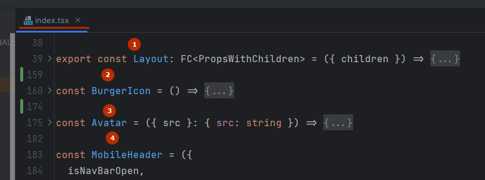

## Общие правила

### 🔥 Включайте только один React компонент в файл.
❌ Пример плохого использования



### 🔥 [Fragment](https://react.dev/reference/react/Fragment)
⚡ Если, компонент на верхнем уровне не требует стилизации, то для того, чтобы не создавать лишнюю обертку используем Fragment (<>...</>) 
```tsx copy showLineNumbers {4,7,14,17}
// ❌ 
const ButtonList1 = () => {
  return (
    <div>
      <button>add</button>
      <button>remove</button>
    </div>
  );
};

// ✅
const ButtonList2 = () => {
  return (
	<>
	  <button>add</button>
	  <button>remove</button>
	</>
  );
};
```

### 🔥 Деструктуризация пропсов
⚡ Деструктурируем пропсы, чтобы писать меньше кода в разметке

```tsx copy showLineNumbers
// ❌
const Button1 = (props) => {
	return <button>{props.text}</button>;
};

// ✅
const Button2 = ({text}) => {
	return <button>{text}</button>;
};
```

### 🔥 Аргументы функции
❗ Избегайте большого количества аргументов. Если больше 2-х аргументов, то объединяем их в объект
```ts showLineNumbers {2,7}
// ❌
const createTodolist1 = (id: string, title: string, author: string) => {
	// code
}

// ✅
const createTodolist2 = (todo: Todo) => {
	const { id, title, author } = todo;
	// code
}
```
### ❌ Работа с импортами
⚡ alias, baseUrl... В разработке
