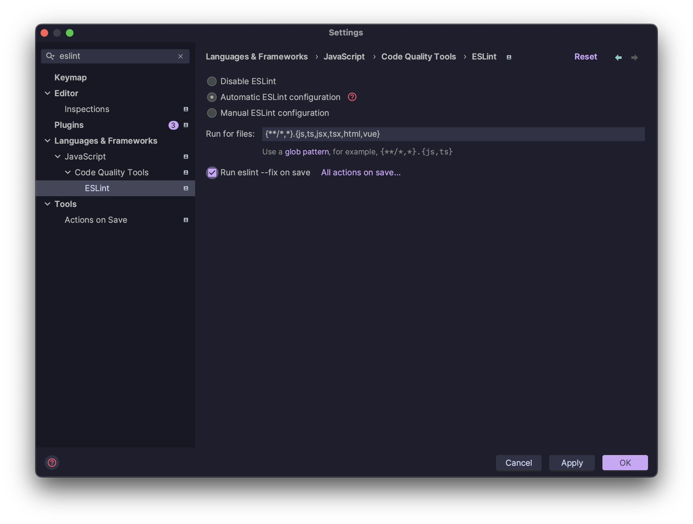
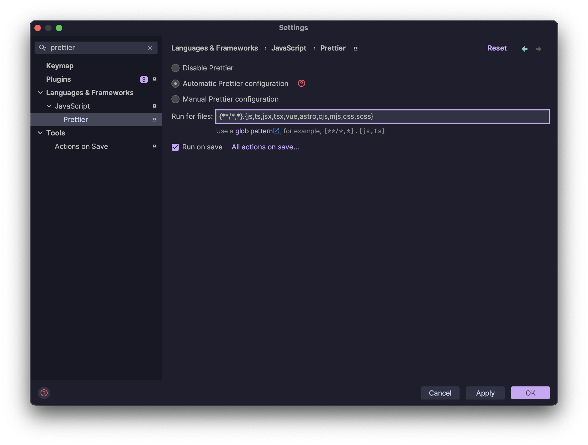
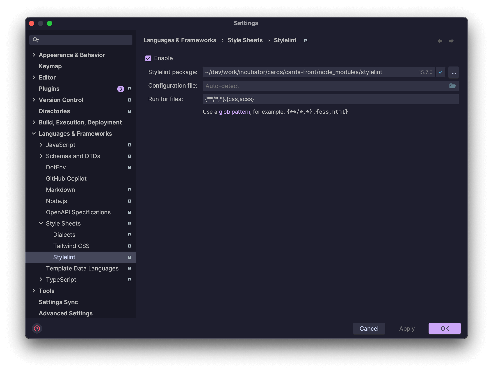
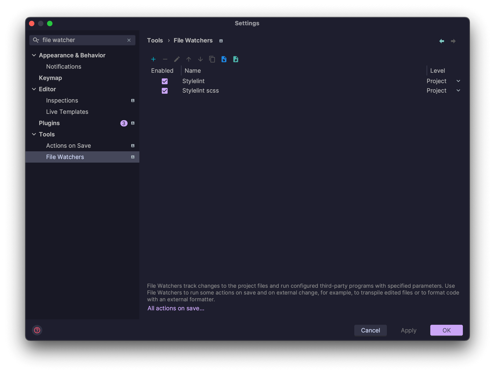
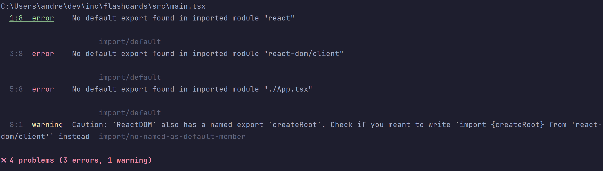

import { Callout } from 'nextra/components'
import { DownloadLink } from '../components/DownloadLink/DownloadLink'
import Link from 'next/link'

# 2. Создание и настройка проекта

## 2.1. Установка зависимостей

### Linters

Мы будем использовать линтеры от команды IT-Incubator:

```bash filename="Terminal"
pnpm i @it-incubator/eslint-config @it-incubator/prettier-config @it-incubator/stylelint-config stylelint -D
```

### SASS

Мы будем использовать SASS в качестве препроцессора стилей:

```bash filename="Terminal"
pnpm i sass -D
```

## 2.2. Конфигурация Alias'ов

### Конфигурация Vite

В файле vite.config.ts добавьте следующий код:

```ts filename="vite.config.ts"
import * as path from 'path'

export default defineConfig({
  plugins: [react()],
  resolve: {
    alias: [{ find: '@', replacement: path.resolve(__dirname, 'src') }],
  },
})
```

Установим типы для nodejs что бы не было ошибок в vite.config.ts

```bash filename="Terminal"
pnpm i @types/node -D
```

### Конфигурация TypeScript

```json filename="tsconfig.json"
{
  "compilerOptions": {
    // ...rest of the template
    "types": ["node"],
    "paths": {
      "@/*": ["./src/*"]
    }
  },
  "include": ["src"],
  "references": [{ "path": "./tsconfig.node.json" }]
}
```

### Использование

Теперь вы можете использовать алиасы везде в проекте:

```tsx filename="App.tsx"
import { App } from '@/App'
```

## 2.3. Конфигурация линтеров

### Prettier

Создайте файл .prettierrc.cjs в корне проекта и скопируйте туда следующее содержимое:

```js filename=".prettierrc.cjs"
module.exports = {
  ...require('@it-incubator/prettier-config'),
  //override settings here
}
```

### ESLint

Замените содержимое файла .eslintrc.cjs на следующее:

```js filename=".eslintrc.cjs"
module.exports = {
  extends: '@it-incubator/eslint-config',
  rules: { 'no-console': ['warn', { allow: ['warn', 'error'] }] },
}
```

### Stylelint

Создайте файл .stylelintrc.cjs в корне проекта и скопируйте туда следующее содержимое:

```js filename=".stylelintrc.cjs"
module.exports = {
  extends: '@it-incubator/stylelint-config',
}
```

## 2.4. Конфигурация WebStorm

### Включить ESLint



### Включить Prettier

```bash
{**/*,*}.{js,ts,jsx,tsx,vue,astro,cjs,mjs,css,scss}
```



### Включить stylelint



### Включить автоматическое исправление ошибок при сохранении .css/.scss файлов

<DownloadLink href="https://drive.google.com/file/d/1oaMa1VHfL_xAsObTUYea1Vtp-w9SHLg_/view?usp=sharing"
              title={'Скачайте файл watchers.xml'}
              description={' и импортируйте его в Settings | Tools | File Watchers'}
/>


После импорта получим следующее: 

### Добавить скрипты в package.json, перезаписывая значения по умолчанию при необходимости

```json lines filename="package.json"
{
  "scripts": {
    "format": "prettier --write src",
    "lint": "eslint --fix src/**/*.{tsx,ts,jsx,js} --no-error-on-unmatched-pattern && stylelint --fix src/{,*/}*.{scss,css} --allow-empty-input"
  }
}
```

### Убрать boilerplate

- Удалить файл App.css
- Удалить папку assets
- Заменить содержимое файла App.tsx на следующее:

```tsx filename="App.tsx"
export function App() {
  return <div>Hello</div>
}
```

### Запустить линтеры

- Prettier

```bash
pnpm run format
```

- Eslint и Stylelint

```bash
pnpm run lint
```

Некоторые ошибки eslint не исправляются автоматически, поэтому вам придется сделать это самостоятельно, например:


Постарайтесь разобраться сами, если не получится - замените содержимое файла main.tsx на следующее:

```tsx filename="main.tsx"
import './index.css'
import { StrictMode } from 'react'

import { createRoot } from 'react-dom/client'

import { App } from './App.tsx'

createRoot(document.getElementById('root') as HTMLElement).render(
  <StrictMode>
    <App />
  </StrictMode>
)
```

<Callout type={'warning'}>
  Наш eslint конфиг использует плагин import\/order, который требует, чтобы ваши файлы **css/scss
  были размещены либо первыми, либо последними в импортах** (см. пример выше), иначе вы получите
  неразрешимые ошибки.
</Callout>
