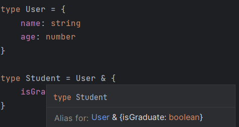
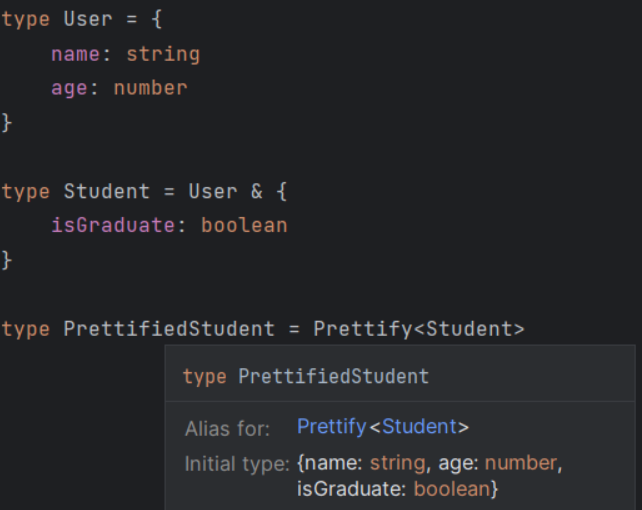

import {Callout} from 'nextra/components'

# 6.1. Общие правила

## 6.1.1. [Any vs unknown](https://google.github.io/styleguide/tsguide.html#any-unknown)

⚡ Стараемся не использовать `any`. `Unknown` предпочтительнее чем `any`.

```ts showLineNumbers
function f(a: any) {
  return a + 100
}

function f(a: unknown) {
  if (typeof a === 'number') {
    return a + 100
  } else {
    return 0
  }
}
```

Пример реального использования

```ts showLineNumbers /err: unknown/
const handleServerNetworkError = (err: unknown, dispatch: AppDispatch): void => {
  let errorMessage = 'Some error occurred'

  if (axios.isAxiosError(err)) {
    errorMessage = err.response?.data?.message || err?.message || errorMessage
  } else if (err instanceof Error) {
    errorMessage = `Native error: ${err.message}`
  } else {
    errorMessage = JSON.stringify(err)
  }
  dispatch(appActions.setAppError({ error: errorMessage }))
  dispatch(appActions.setAppStatus({ status: 'failed' }))
}
```

## 6.1.2. [Типизация возвращаемого значения функции](https://google.github.io/styleguide/tsguide.html#return-types)

- Более точная документация для удобства чтения кода.
- Более быстрое обнаружение потенциальных ошибок типа в будущем, если в коде произойдут изменения, изменяющие возвращаемый тип функции.

```ts showLineNumbers /string/
const minutesToHHMM = (minutes: number): string => {
  let hours = Math.floor(minutes / 60)
  let remainderMinutes = minutes % 60
  let formattedHours = hours < 10 ? '0' + hours : hours
  let formattedMinutes = remainderMinutes < 10 ? '0' + remainderMinutes : remainderMinutes

  return `${formattedHours}:${formattedMinutes}`
}
```

## 6.1.3. Типизация массивов

⚡ Типизируем массив через [квадратные скобки](https://google.github.io/styleguide/tsguide.html#arrayt-type)

| ✅ Good  | ❌ Bad        |
| :------- | :------------ |
| `User[]` | `Array<User>` |

## 6.1.4. Что использовать `type` или `interface`?

- Предлагаю использовать `types` по дефолту, а `interface` в случае [необходимости](https://youtu.be/zM9UPcIyyhQ?si=fAIJVNTf8gUsxDsI)
- Однако google style предлагает [иначе](https://google.github.io/styleguide/tsguide.html#interfaces-vs-type-aliases)

## 6.1.5. [Nullable/undefined type aliases](https://google.github.io/styleguide/tsguide.html#nullableundefined-type-aliases)

<Callout type={'info'}>
    В union (объединенных) типах не следует использовать комбинации `|null` или `|undefined`.
    * Подобные псевдонимы, которые допускают значение `null` или `undefined`, обычно указывают на то,
    что нулевые значения передаются через множество уровней приложения, и это усложняет определение
    источника первоначальной проблемы, из-за которой появился null.
    * Это также делает неясным, когда
    конкретные значения в классе или интерфейсе могут отсутствовать.
    * Вместо этого код должен
    добавлять `|null` или `|undefined` только тогда, когда это действительно необходимо. Код должен
    обращаться с нулевыми значениями там, где они возникают, используя вышеуказанные методы.
</Callout>

```ts
// ❌ Bad
type Status1 = 'success' | 'failed' | null

const func1 = (status: Status1) => {}

// ✅ Better. Код должен работать с нулевыми значениями в непосредственной близости от места их возникновения
type Status = 'success' | 'failed'

const func2 = (status: Status2 | null) => {}

// ✅✅ Best. Используем кастомный Nullable type
export type Nullable<T> = T | null

type Status = 'success' | 'failed'

const func3 = (status: Nullable<Status>) => {}
```

## 6.1.6. [Prettify type aliase](https://www.totaltypescript.com/concepts/the-prettify-helper)

<Callout type={'info'}>
    В intersected типах желательно использование кастомного типа Prettify.
</Callout>

⚡ Это упрощает чтение, т. к. не будет вложенных типов с неочевидными значениями, для уточнения которых требуется переходить к типу.

```ts
// ❌ Bad
type User = {
  name: string
  age: number
}

type Student = User & {
  isGraduate: boolean
}

```


```ts showLineNumbers filename="prettify.ts"
// ✅ Good for prettifying and easier reading intersected types
export type Prettify<T> = {
    [K in keyof T]: T[K]
}

type User = {
  name: string
  age: number
}

type Student = User & {
  isGraduate: boolean
}

type PrettifiedStudent = Prettify<Student>

```


## 6.1.7. Wrapper types (`String`, `Boolean`, `Number`)

❗ Для примитивов никогда не используем [wrapper types](https://google.github.io/styleguide/tsguide.html#wrapper-types)
