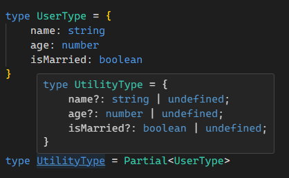
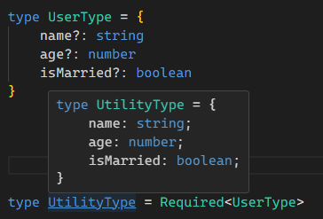
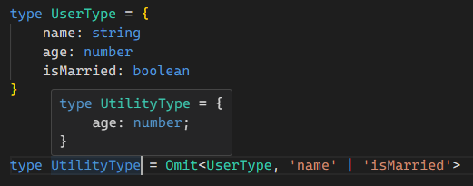
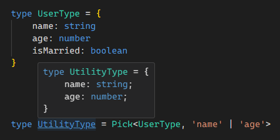

import {Callout} from "nextra/components";

# Utility Types

<Callout type={'info'} emoji={'🔗'}>
    [Utility Types](https://www.typescriptlang.org/docs/handbook/utility-types.html)
</Callout>

### ⚡1. Partial
``` ts showLineNumbers copy filename="partial.ts"
type UserType = {
    name: string
    age: number
    isMarried: boolean
}

type UtilityType = Partial<UserType>
```


### ⚡2. Required
``` ts showLineNumbers copy filename="required.ts"
type UserType = {
    name?: string
    age?: number
    isMarried?: boolean
}

type UtilityType = Required<UserType>
```



### ⚡3. Omit
``` ts showLineNumbers copy filename="omit.ts"
type UserType = {
    name: string
    age: number
    isMarried: boolean
}

type UtilityType = Omit<UserType, 'name' | 'isMarried'>
```



### ⚡4. Pick
``` ts showLineNumbers copy filename="pick.ts"
type UserType = {
    name: string
    age: number
    isMarried: boolean
}

type UtilityType = Omit<UserType, 'name' | 'isMarried'>
```



### ⚡5. Record
``` ts showLineNumbers copy filename="record.ts"
export type TasksStateType = {
  [key: string]: TaskType[]
}

export type TasksStateType2 = Record<string, TaskType[]>


// Как типизировать объект в котором свойства и значения могут быть любые ?

const Object = {
  a1: "a1",
  b2: 2,
  c9: true,
}

type ObjectType = Record<string, unknown>
```

